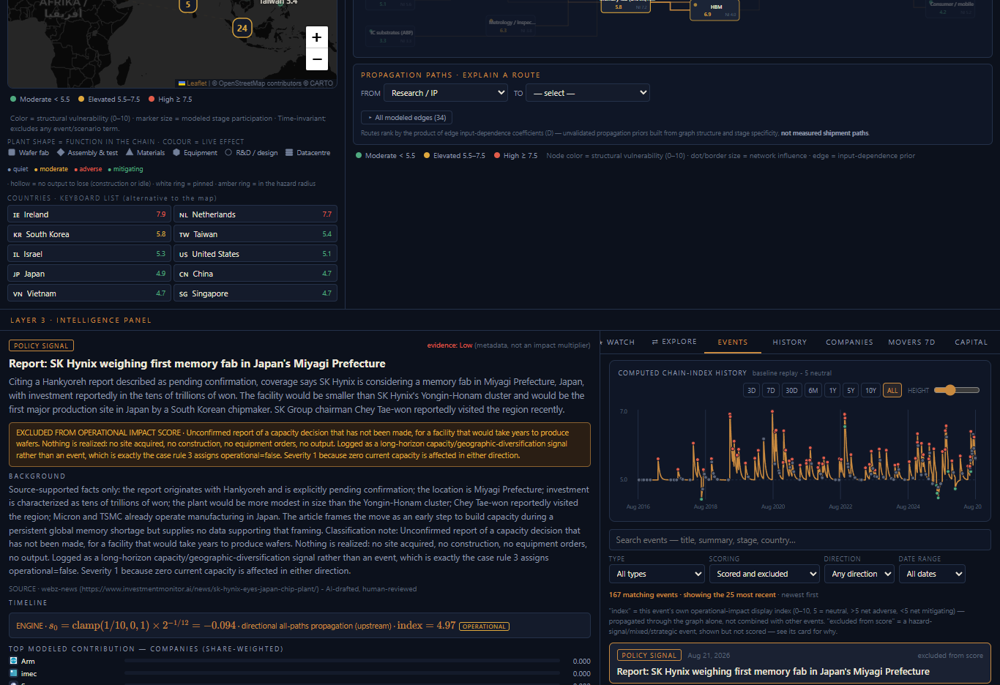
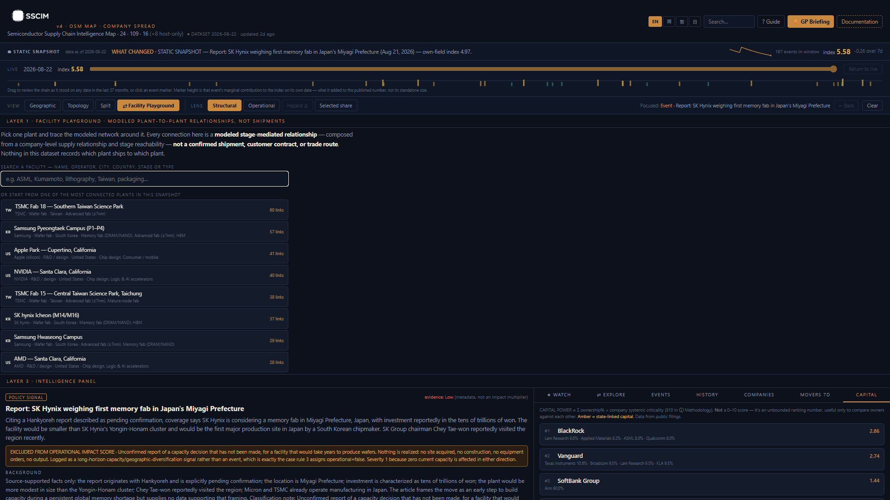
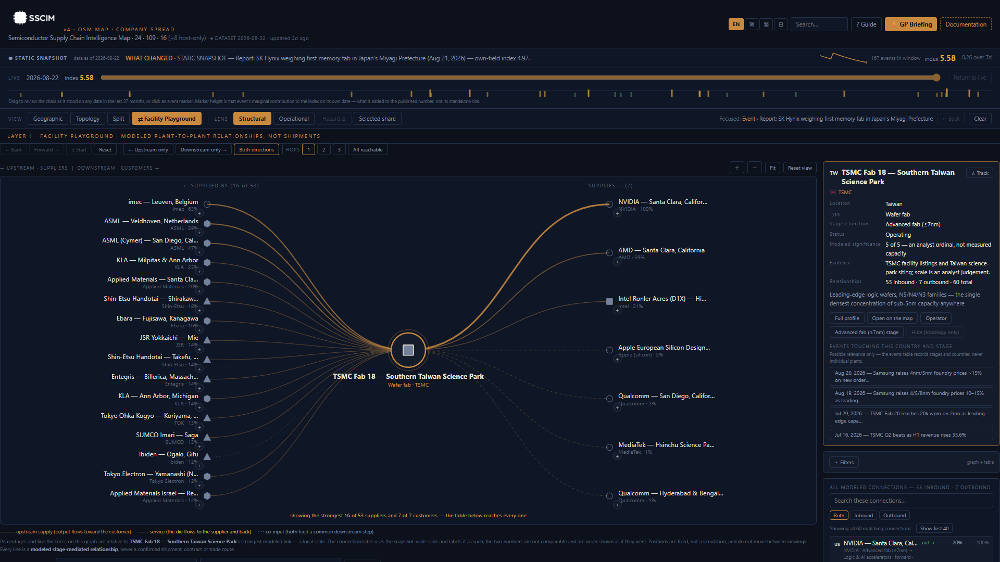
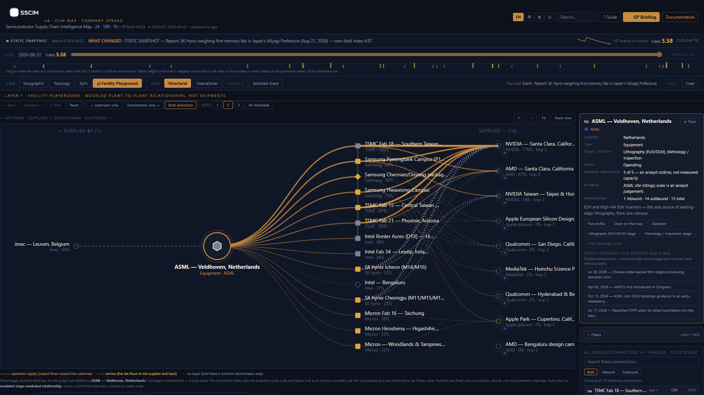
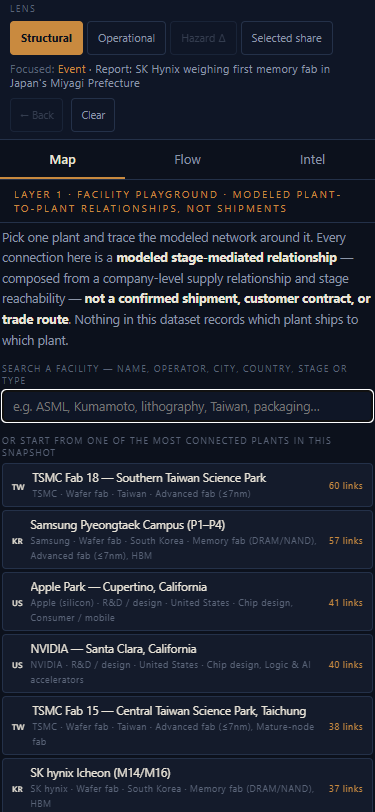

# SSCIM — Semiconductor Supply Chain Intelligence Map

An explainable research tool for tracing how a semiconductor disruption moves
through a modeled supply chain. Pick a plant, an event, a stage or a country,
and see what it touches — with the propagation arithmetic shown rather than
hidden behind a single risk score.

**Live deployment:** <https://railgunbreaker.github.io/sscim/>

**SSCIM is not** a live trading signal, a prediction engine, a measured
trade-flow model, or investment advice. Every propagation coefficient is a
**declared prior**, chosen to be directionally sensible and inspectable, and
fitted to nothing.

---

## Screenshots

| | |
| --- | --- |
| **Layer 3 · Events** — the feed fills its column, with search, four filters and an exact match count |  |
| **Facility Playground · starting state** — a search field, not a dump of 275 plants |  |
| **Facility Playground · TSMC Fab 18** — 53 inbound and 7 outbound relationships, with the visible count stated exactly and the table beside it reaching every one |  |
| **Facility Playground · ASML, two hops** — multi-hop traversal, upstream left, downstream right |  |
| **Mobile** — search, graph, filters and details stack |  |

---

## What it does

- **Facility Playground** — pick one of 275 named plants and trace the modeled
  network around it: suppliers left, customers right, one hop or three or
  everything reachable. Expand a neighbour, collapse a branch, recentre on
  anything, walk back and forward, filter by company / country / stage /
  relationship type / strength, and open any connection to see exactly which
  company edge and which stage reach produced it.
- **Geographic view** — every plant on a world map with the modeled links
  between them, and a hazard radius you can drop anywhere.
- **Functional-centre topology** — 126 country × stage centres and 1,030
  modeled connections, with routes, reachability, betweenness, and reversible
  node/edge removal.
- **History review** — the chain as it stood on any past date, recomputed by
  engine replay rather than read from a stored series.
- **Hazard screening** — which named plants a footprint touches, what share of
  each chain step they carry, and which modeled links it would sever.
- **Briefing generation** — a written summary of the current reading.
- **Shareable state** — view, pinned entity, reviewed date and the whole
  playground exploration travel in the URL.

Every facility-to-facility connection is a **modeled stage-mediated
relationship** — composed from a company-level supply relationship and stage
reachability — and never a confirmed shipment, customer contract or trade
route. Nothing in this dataset records which plant ships to which plant.

---

## Architecture

```
app/      React 18 + Vite. Six entry points built from one project:
          landing, guide, updates, dashboard, docs reader, admin console.
          The engine (app/src/engine/) is pure JS — no React, no DOM — so
          every propagation rule is unit-testable on its own.

server/   Express + SQLite (better-sqlite3). Holds the vault: companies,
          stages, the customer graph, facilities, events, owners, quotes.
          Serves /api/bundle to the dashboard and an admin API behind a
          bearer token.

docs/     Methodology, guides, and the generated reference library
          (source register, evidence coverage).

dist-app/ Build output. Deployed to GitHub Pages by .github/workflows/.
```

**The data path, and why the site works without a server.** The vault lives in
`server/data/sscim.db`, which is committed. `npm run snapshot` exports it to
`app/src/data/vault-snapshot.json`, which the build bundles. At runtime the
dashboard tries the API first and falls back to that snapshot when it is
unreachable — which is the normal case on GitHub Pages. **The static site never
depends on a machine being switched on**; the fallback is the deployment model,
not a failure mode, and the interface says `STATIC SNAPSHOT` rather than `LIVE`
when it is in use.

---

## Local setup

Requires Node 24+ (the snapshot export uses `process.loadEnvFile`).

```bash
git clone https://github.com/RailgunBreaker/sscim.git
cd sscim

cd server && npm ci      # better-sqlite3 builds here
cd ../app  && npm ci

npm run dev              # from app/ — exports the snapshot, builds docs, serves
```

`npm run dev` runs the snapshot export and documentation build first, so a
fresh clone gets a working dashboard with no further steps. The API is
optional; without it the app uses the snapshot.

To run the API as well:

```bash
cd server
cp .env.example .env     # set ADMIN_TOKEN to enable the admin surface
npm run dev              # http://localhost:8787 — also serves a status console at /
```

---

## Commands

### `app/`

| Command | What it does |
| --- | --- |
| `npm run dev` | Snapshot + docs, then the Vite dev server |
| `npm run build` | Snapshot + docs, production build to `dist-app/`, then the doc pages |
| `npm run snapshot` | Export `server/data/sscim.db` → `vault-snapshot.json` + landing stats |
| `npm run docs` | Rebuild the documentation library and runtime manifest |
| `npm run audit:data` | Read-only integrity audit over the exported snapshot |
| `npm test` | The full vitest suite |
| `npm run smoke` | Browser smoke suite over `dist-app/` at five viewports |
| `npm run smoke -- --shots` | The same, writing screenshots to `docs/screenshots/` |

### `server/`

| Command | What it does |
| --- | --- |
| `npm run dev` | Start the vault API |
| `npm run pipeline` | Ingest → draft → triage → queue (add `--dry-run` to preview) |
| `npm run review` | Review the candidate queue from the terminal |
| `npm run sources` | Regenerate the source register and the evidence-coverage report |
| `npm run repair:provenance` | Idempotent repair of event provenance, public notes and incident grouping |

---

## Data refresh

1. `cd server && npm run pipeline` — ingests candidates, drafts classifications, triages the queue.
2. Review what is pending: `npm run review`, or the admin console at `admin.html` with `ADMIN_TOKEN` set.
3. Approve or reject. Approval inserts the event, appends its classification to `app/src/engine/event-assumptions.js`, and rolls the whole thing back if the assumption write fails.
4. `cd ../app && npm run snapshot` — checkpoints the WAL and re-exports.
5. `npm run audit:data && npm test` — the gate.
6. Commit the updated `.db` and push. The Pages workflow rebuilds and redeploys.

**Automatic approval is opt-in and off by default.** With
`SSCIM_TRIAGE_AUTO_APPROVE` unset, every relevant candidate waits for a person.
Set it to `on` for bounded unattended approval (High confidence only, no
duplicate flag, never without a draft). Anything approved that way is recorded
with `provenance='automatic'` and says so in its published source line; no
reviewer identity is ever invented. Automatic *rejection* is configured
separately (`SSCIM_TRIAGE_AUTO_REJECT`, default on) — a wrongly rejected
candidate stays in the queue and costs one glance to recover, while a wrongly
approved one is already published and already moving the index.

---

## Audit and test

```bash
cd app
npm run audit:data   # schema + graph integrity over the exported snapshot
npm test             # unit, engine and component tests
npm run build        # production build (also runs snapshot, docs, doc pages)
npm run smoke        # browser suite: layout at five viewports, playground, a11y
```

The audit fails the build on malformed data — dangling references, non-finite
values, out-of-range shares, an invalid stage graph. It reports warnings
separately and does not fail on them.

**A passing audit is a structural result, not a factual one.** See
[evidence coverage](docs/reference/EVIDENCE-COVERAGE.md), which keeps five
claims apart: schema integrity, graph integrity, citation completeness, source
quality, and factual validation. The last of those is **not established** for
this dataset — no figure has been checked against an independent measurement.

---

## Deployment

`.github/workflows/` builds and deploys to GitHub Pages on every push to `main`,
plus a daily rebuild so bundled stock quotes stay fresh. The workflow installs
both packages, refreshes quotes best-effort, exports the snapshot, runs the data
audit and the unit tests, and only then builds and uploads.

The Express backend does not run on Pages. If you host it elsewhere, set the
`VITE_API_BASE_URL` repository variable and the deployed dashboard will read
live data instead of the bundled snapshot — with no code change, and with the
snapshot still there as the fallback.

---

## Security model

- **Admin routes are behind a bearer token** (`ADMIN_TOKEN`). Without it the
  admin API answers 503 rather than running unauthenticated.
- **No token reaches a build artifact.** `ADMIN_TOKEN` is read from
  `server/.env` by the server process only; nothing in `app/` references it.
- **CORS is an allowlist.** localhost is always permitted so development needs
  no configuration; anything else comes from `SSCIM_ALLOWED_ORIGINS`. Requests
  with no `Origin` header (curl, the pipeline, health checks) pass, because
  those are not browser cross-origin requests at all.
- **Authenticated writes are rate-limited** — 60 per minute per credential by
  default (`SSCIM_ADMIN_RATE_MAX`, `SSCIM_ADMIN_RATE_LIMIT=off`). Reads are not
  limited, because the admin dashboard polls them. This does not replace the
  token; it bounds what a leaked one can do per minute on paths that insert
  events and can trigger a publish.
- **Internal review notes never reach public output.** Candidate identifiers,
  approve/reject commands and the publication log stay in `event_candidates`
  behind the admin token. Two independent guards enforce it — one on write, one
  on render — and a test over the generated snapshot fails the build if either
  is bypassed.
- **The public site has no server dependency.** It reads a committed snapshot.

---

## Limitations

- **No facility-level capacity, inventory, bill-of-materials, qualification or
  recovery-time data.** A capacity-constrained shock — a fab physically
  destroyed — would propagate differently than this model shows.
- **Facility significance is an analyst ordinal (1–5), not measured capacity.**
  Every share derived from it is a share of the modeled sample, never of world
  output.
- **Facility-to-facility links are composed, never observed.** They are the
  most that can honestly be built from company-level revenue share and stage
  adjacency.
- **Coverage is a curated sample.** An empty hazard radius means "no site in
  this sample", never "no site".
- **Country coverage has two tiers.** 16 countries carry a production share and
  contribute to scores; 8 more host facilities and contribute to none. The
  interface distinguishes them.
- **Propagation coefficients are declared priors, fitted to nothing.** See
  [MODEL_ROADMAP.md](docs/MODEL_ROADMAP.md) for what calibration would require.
- **Nothing here is a causal or probabilistic forecast.**

---

## Documentation

| | |
| --- | --- |
| [Project overview](docs/README.md) | What SSCIM is, in one page ([日本語](docs/README.ja.md) · [简体中文](docs/README.zh.md)) |
| [Public guide](docs/PUBLIC_GUIDE.md) | Plain-language walkthrough |
| [Methodology](docs/METHODOLOGY.md) | Every formula and declared prior |
| [Worked calculations](docs/calculation.md) | The arithmetic, step by step |
| [Academic guide](docs/ACADEMIC_GUIDE.md) | How to cite it, and what not to claim |
| [Developer guide](docs/DEVELOPER_GUIDE.md) | Set up, build, change |
| [System architecture](docs/SYSTEM_ARCHITECTURE.md) | How the pieces fit |
| [**Source register**](docs/reference/SOURCE-REGISTER.md) | Every source cited, in Chicago style, with each citation's completeness graded |
| [**Evidence coverage**](docs/reference/EVIDENCE-COVERAGE.md) | How much of the dataset is sourced at all, and what a passing audit does not establish |
| [Model roadmap](docs/MODEL_ROADMAP.md) | Delivered, planned, and the gates between |

---

## License

**No license has been chosen for this repository.** Without one, default
copyright applies: the source is readable here, but no reuse, modification or
redistribution rights are granted.

Selecting a license is the repository owner's decision and has deliberately not
been made on their behalf. Until one is added, treat this code as
all-rights-reserved.
